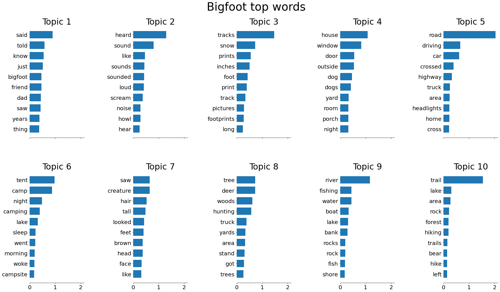

# Hunting Through Random Forest for BigFoot: Descending a Ridge to Find the Decomposed Remains

## Raw (Hairy) Data:

The raw data took the form of a JSON file of HMTL code. 

We read it into a dataframe with the following line: 
```python
data = pd.read_json('data/bigfoot_data.json', lines=True)
```

It became clear that the 'html' column was the column of interest, and since it was still a dense thicket of HTML, we cooked up a function using BeautifulSoup to parse the html. This parser took the 'html' column as input and returned a dataframe indexed by report ID, with features and observations corresponding to the key-value pairs of each report. 

## Features: 
* Year, with some data going back as far as the 1800s, up to the present
* Season
* Month
* State
* Location Details
* Nearest Town
* Nearest Road
* Observed
* Also Noticed
* Other Witnesses
* Other Stories
* Time and Conditions
* Environment


# Details of Text Processing Pipeline:

The text of interest was found in the "Observed" column of the dataframe, which contains the witnesse's description of the encounter. It was processed using tfidf after removing English stopwords and converting the data to unicode. 

# ML Algorithms

## NMF
We used an implementation of NMF to produce a topic analysis on the Observations. Analyzing for 10 componenents with max_iter of 500, the nmf model was able to identify distinct topics that generally described the circumstances in which the observer saw the creature:



## Interpreation of NMF Topics:
Topics were fairly distinct and generally described the locational circumstances where the observer made a sighting (Topics 4,5,6,8,9,10). The remainder tended to be some physical description or vestige of the creature itself (Topics 2, 3). Topic 1 was the most generic/vague and difficult to pin down, but the presence of words like "told, know, just, years" may convey a sense of certainty about the story, i.e., "I just know, from my years of experience..."

### Topic Breakdown
* Topic 1 - certainty of encounter
* Topic 2 - auditory descriptions
* Topic 3 - tracks
* Topic 4 - building from which it was encountered
* Topic 5 - road/driving encounters
* Topic 6 - camping encounters
* Topic 7 - description of creature
* Topic 8 - hunting in (random?) forest encounters
* Topic 9 - water/marine encounters
* Topic 10 - trail encounters 


## K Means


